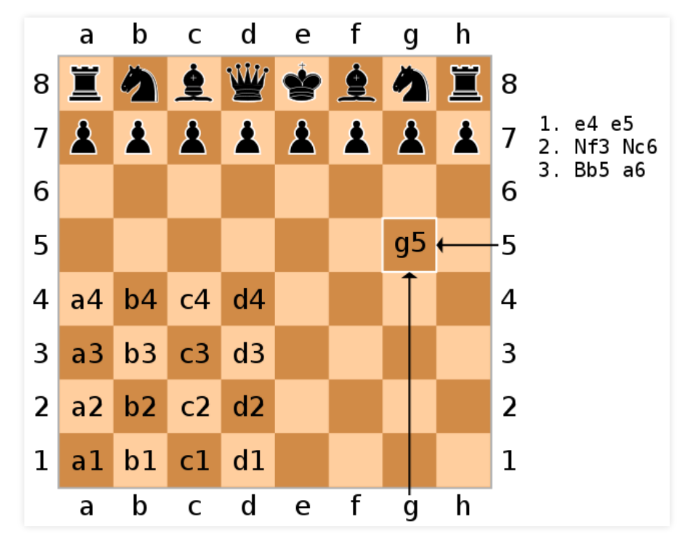
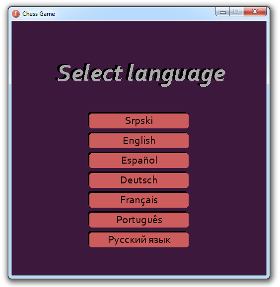

# JSD
Jednostavan DSL jezik za predmet Jezici specifični za domen koji služi za generisanje šahovskih notacija.

## Ideja
Ideja je napraviti DSL sa pravilima za internacionalizaciju/lokalizaciju tako da se mogu komande igre prilagođavati izabranom prirodnom jeziku. Pravila za internacionalizaciju/lokalizaciju bi bila DSL koji bi se u toku igre tumačio i omogućavao parsiranje komandi. Sama pravila lokalizacije bi se konfigurisale prilikom pokretanja aplikacije gde korisnik može da izabere jezik koji će koristiti u toku partije.

Ovakav DSL bi bio u mogućnosti da na osnovu izabrane konfiguracije tumači poteze koji su uneti preko konzole i da definiše neke specifičnosti prirodnog jezika (npr. red reči u rečenici, upotreba predloga i sl). Za ovo je neophodno proučiti kako bi se pomeranje figure moglo reći na par različitih jezika. 

